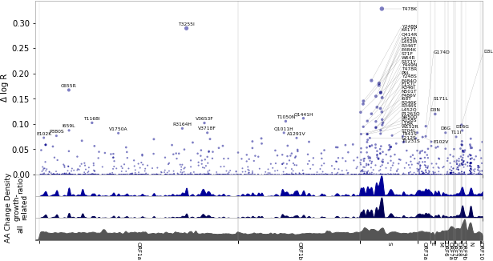
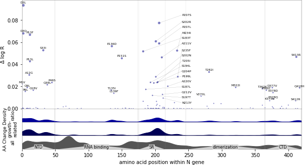
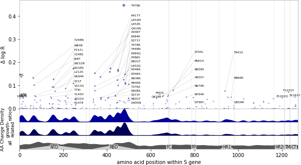
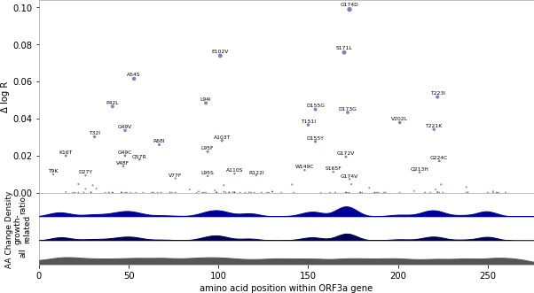
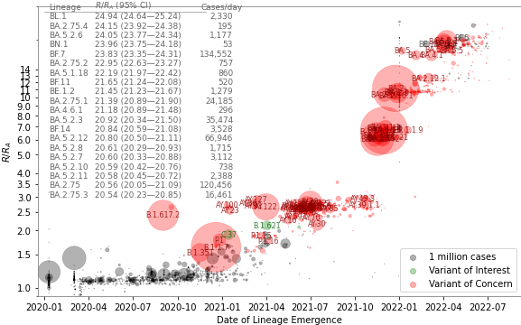
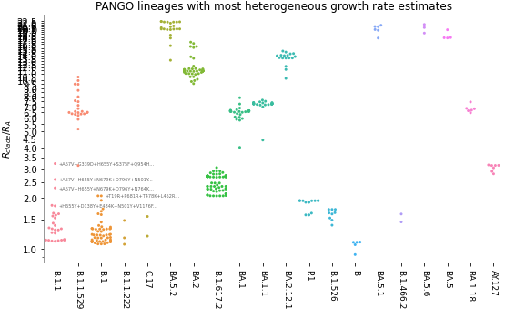

# Images and data for publication

This directory contains figures and tables output by the [PyR0
model](https://www.medrxiv.org/content/10.1101/2021.09.07.21263228v1). These
outputs are aggregated to weeks, PANGO lineages, and amino acid changes.

Figures and tables are generated by first running preprocessing and inference,
then postprocessing with the following Jupyter notebooks:
[ `mutrans.ipynb` ](../mutrans.ipynb),
[ `mutrans_gene.ipynb` ](../mutrans_gene.ipynb),
[ `mutrans_prediction.ipynb` ](../mutrans_prediction.ipynb),
[ `mutrans_backtesting.ipynb` ](../mutrans_backtesting.ipynb).

## Data tables

- [Mutation table](mutations.tsv) is ranked by statistical significance.
  The "mean" field denotes the estimated effect on log growth rate of each mutation.
- [Lineage table](strains.tsv) is ranked by growth rate.

## Manhattan plots

## Information density plots

## Volcano plot

## Strain characterization plots

## Cross validation plots

The following plots assess robustness via 2-fold crossvalidation, splitting data into Europe versus (World w/o Europe).

## Data plots

## Acknowledgements

The aggregated model outputs in this directory were generated from data inputs
including GISAID records (https://gisaid.org), PANGO lineage classifications
(https://cov-lineages.org), and case count time series from Johns-Hopkins
University (https://github.com/CSSEGISandData/COVID-19).

We gratefully acknowledge all data contributors, i.e. the Authors and their Originating laboratories responsible for obtaining the specimens, and their Submitting laboratories for generating the genetic sequence and metadata and sharing via the GISAID initiative [1,2] on which this research is based. A total of 2,160,748 submissions are included in this study. A complete list of 2.1million accession numbers are available in [accession_ids.txt.zip](accession_ids.txt.zip).

1.  GISAID Initiative and global contributors,
    EpiCoV(TM) human coronavirus 2019 database.
    GISAID (2020), (available at https://gisaid.org).
2.  S. Elbe, G. Buckland-Merrett,
    Data, disease and diplomacy: GISAID's innovative contribution to global health.
    Glob Chall. 1, 33-46 (2017).
